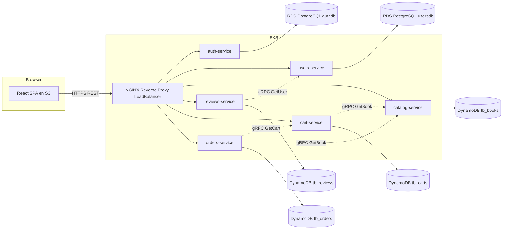

# MyBookstore - Microservicios sobre Kubernetes (EKS)

Aplicación de tienda de libros descompuesta en 6 microservicios en Node.js, cada uno con **arquitectura hexagonal**, comunicándose entre sí por **gRPC** y expuestos al exterior por un **NGINX** que actúa como reverse proxy. Frontend en React desplegado como sitio estático en S3. Persistencia: **2 instancias RDS PostgreSQL** y **4 tablas DynamoDB**, una por servicio.

---

## Arquitectura



### Los 6 microservicios

| Servicio | HTTP | gRPC | Persistencia | Llama por gRPC a |
|---|---|---|---|---|
| `auth-service` | 3001 | – | RDS PostgreSQL `authdb` | – |
| `users-service` | 3002 | 50052 | RDS PostgreSQL `usersdb` | – |
| `catalog-service` | 3003 | 50053 | DynamoDB `tb_books` | – |
| `reviews-service` | 3004 | – | DynamoDB `tb_reviews` | `users-service` |
| `cart-service` | 3005 | 50055 | DynamoDB `tb_carts` | `catalog-service` |
| `orders-service` | 3006 | – | DynamoDB `tb_orders` | `cart-service`, `catalog-service` |

Réplicas: **2 por microservicio**, **1 para NGINX**.

---

## Estructura del repositorio

```
mybookstore/
├── frontend/                       React + Vite (deploy a S3)
├── services/
│   ├── auth-service/               Hexagonal, HTTP, Postgres
│   ├── users-service/              Hexagonal, HTTP + gRPC, Postgres
│   ├── catalog-service/            Hexagonal, HTTP + gRPC, DynamoDB
│   ├── reviews-service/            Hexagonal, HTTP, DynamoDB + grpc client a users
│   ├── cart-service/               Hexagonal, HTTP + gRPC, DynamoDB + grpc client a catalog
│   └── orders-service/             Hexagonal, HTTP, DynamoDB + grpc clients a cart y catalog
├── shared/
│   ├── proto/                      .proto compartidos: catalog.proto, users.proto, cart.proto
│   └── auth-middleware/            Paquete npm con requireAuth (JWT) compartido
├── infra/
│   ├── nginx/                      nginx.conf (k8s) y nginx.local.conf (docker-compose)
│   └── kubernetes_cluster/         Manifiestos K8s (sin prefijos numéricos)
└── docker-compose.local.yml        Postgres x2 + DynamoDB Local + NGINX
```

Dentro de cada microservicio, hexagonal:

```
src/
├── domain/                  Entidades y errores de negocio
├── application/
│   ├── ports/out/           Puertos (interfaces) hacia el exterior
│   └── use-cases/           Casos de uso
├── infrastructure/
│   ├── config/              Conexiones (Postgres, DynamoDB)
│   ├── inbound/
│   │   ├── http/            Express (controllers, routes)
│   │   └── grpc/            Servidor gRPC (cuando aplica)
│   ├── outbound/
│   │   ├── persistence/     Implementación del repositorio
│   │   ├── security/        Implementaciones JWT/bcrypt (auth-service)
│   │   └── grpc-clients/    Clientes gRPC hacia otros servicios
│   └── grpc/                Util compartido (proto-path)
├── composition-root.js      Wiring de dependencias
└── server.js                Entry point
```

---

## Desarrollo local

### 1. Levantar infraestructura local

Necesitas Docker Desktop corriendo. Desde la raíz:

```bash
docker compose -f docker-compose.local.yml up -d
```

Esto arranca:
- `postgres-auth` en `localhost:5432`
- `postgres-users` en `localhost:5433`
- `dynamodb-local` en `localhost:8000`
- `nginx` en `localhost:8080` (apunta a los servicios corriendo en tu host)

### 2. Crear tablas DynamoDB locales y semillas

```bash
cd services/catalog-service && npm run seeder
cd ../cart-service && npm run create-table
cd ../reviews-service && npm run create-table
cd ../orders-service && npm run create-table
```

### 3. Configurar variables de entorno

En cada servicio copia su `.env.example` a `.env`:

```bash
for s in auth-service users-service catalog-service reviews-service cart-service orders-service; do
  cp services/$s/.env.example services/$s/.env
done
```

### 4. Arrancar los 6 servicios

En 6 terminales (o usa un orquestador como `concurrently`):

```bash
cd services/auth-service    && npm run dev
cd services/users-service   && npm run dev
cd services/catalog-service && npm run dev
cd services/reviews-service && npm run dev
cd services/cart-service    && npm run dev
cd services/orders-service  && npm run dev
```

### 5. Frontend

```bash
cd frontend
npm install
npm run dev
```

Vite levanta en `http://localhost:5173` y consume el API por `VITE_API_URL=http://localhost:8080` (NGINX).

---

## Despliegue a AWS

El despliegue se hace manualmente desde la consola de AWS (Learner Lab). Recursos a crear:

- **ECR**: 6 repositorios, uno por microservicio
- **RDS PostgreSQL**: 2 instancias (`authdb` y `usersdb`)
- **DynamoDB**: 4 tablas (`tb_books`, `tb_reviews`, `tb_carts`, `tb_orders`), todas con clave primaria `id` (string)
- **EKS**: 1 cluster con 2 nodos, aplicar los manifiestos de `infra/kubernetes_cluster/`
- **S3**: 1 bucket con static website hosting para el frontend (build con `VITE_API_URL` apuntando al ELB del NGINX)

---

## Smoke test E2E

Desde tu máquina, contra el ELB del NGINX:

```bash
ELB=http://<EXTERNAL-IP-del-nginx>

curl $ELB/api/books/
curl -X POST $ELB/api/auth/register -H 'Content-Type: application/json' -d '{"name":"Lesdi","email":"l@x.com","password":"123456"}'
TOKEN=$(curl -s -X POST $ELB/api/auth/login -H 'Content-Type: application/json' -d '{"email":"l@x.com","password":"123456"}' | jq -r .token)
curl $ELB/api/users/me -H "Authorization: Bearer $TOKEN"
curl -X POST $ELB/api/cart/items -H "Authorization: Bearer $TOKEN" -H 'Content-Type: application/json' -d '{"bookId":"1","qty":2}'
curl -X POST $ELB/api/orders -H "Authorization: Bearer $TOKEN"
curl $ELB/api/orders -H "Authorization: Bearer $TOKEN"
curl -X POST $ELB/api/reviews/book/1 -H "Authorization: Bearer $TOKEN" -H 'Content-Type: application/json' -d '{"rating":5,"comment":"top"}'
curl $ELB/api/reviews/book/1
```

Si todas las llamadas devuelven 200/201, los 6 servicios están conversando correctamente entre sí (cart→catalog gRPC, orders→cart+catalog gRPC, reviews→users gRPC).
